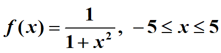
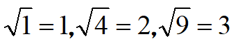
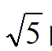
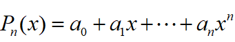
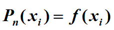
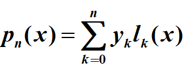
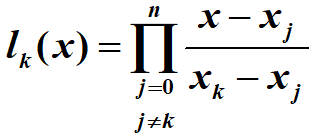
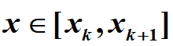
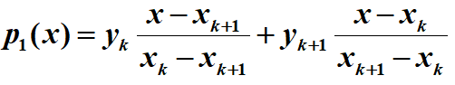
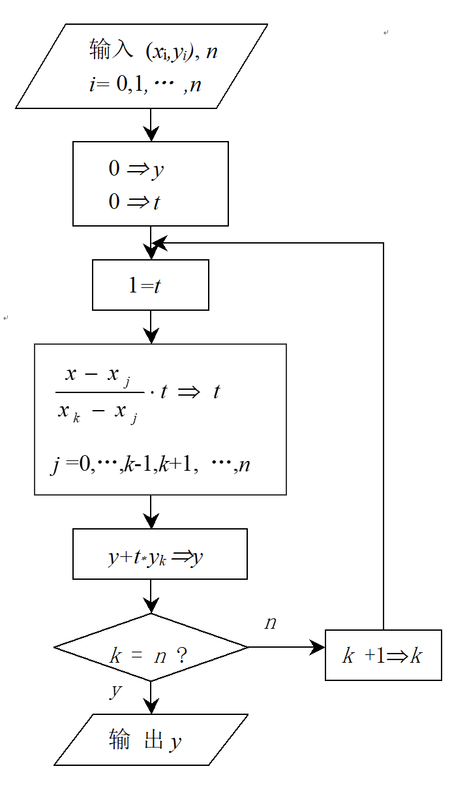

# Interpolation-Fitting_exp

Numerical Analysis exp-1: Interpolation &amp; Fitting(插值与拟合)(拉格朗日插值|分段插值|牛顿插值)

实验一	插值与拟合

1  实验目的

(1)	明确插值多项式和分段插值多项式各自的优缺点；

(2)	编程实现拉格朗日插值算法，分析实验结果体会高次插值产生的龙格现象；

(3)	理解最小二乘拟合，并编程实现线性拟合，掌握非线性拟合转化为线性拟合的方法

(4)	运用常用的插值和拟合方法解决实际问题。

2  实验内容

(1)	对于 

要求选取11个等距插值节点，分别采用拉格朗日插值和分段线性插值，计算x为0.5, 4.5处的函数值并将结果与精确值进行比较。

输入：区间长度，n(即n+1个节点)，预测点

输出：预测点的近似函数值，精确值，及误差

（2）已知  用牛顿插值公式求  的近似值。

输入：数据点集，预测点。

输出：预测点的近似函数值

3  算法基本原理

当精确函数 y = f(x) 非常复杂或未知，在一系列节点 x0 … xn 处测得函数值 y0 = f(x0), … yn = f(xn)， 希望由此构造一个简单易算的近似函数 g(x) » f(x)，满足条件g(xi) = f(xi)  (i = 0, … n)。这里的 g(x) 称为f(x) 的插值函数，由插值函数可以去近似估计f(x)在一些未知点处的函数值。最常用的插值函数是多项式插值。                         

所谓多项式插值即求 n 次多项式  使得 

基于基函数的拉格朗日插值是构造多项式插值最基本方法。也是推导数值微积分和微分方程数值解的公式的理论基础。

拉格朗日插值公式为：   其中 

当结点比较多，次数较高的插值多项式往往发生Runge现象，分段低次插值是避免Runge现象的重要手段。分段一次插值将整个区间分段，在每个小区间上，用一次多项式逼近 f (x)，直观上即用折线代替曲线，只要区间足够小就可以保证很好的逼近效果，但曲线缺乏光滑性。

4  算法描述                                                  

(1)	拉格朗日插值算法见流程图

(2)	分段线性插值算法要注意以下关键点：

A.	定位：预测点x在第几个区间？

B.	假定x在第k个区间，

即  

一次插值公式为 

5  计算用例的参考输出

（1）实验1参考输出如下

X		    y(精确)	    y(拉格朗日) y(分段线性)    误差(拉)    误差(分)

0.500000		0.800000		0.843408		0.750000	 	-0.043408	  0.050000

4.500000		0.047059		1.578721    0.048643		 -1.537662	  -0.001584

6 思考题

(1) 由实验1体会插值中龙格现象产生的原因

(2) 牛顿插值和拉格朗日插值有什么区别和联系？
