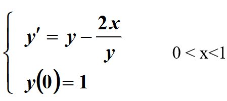
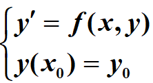
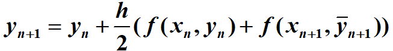
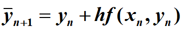
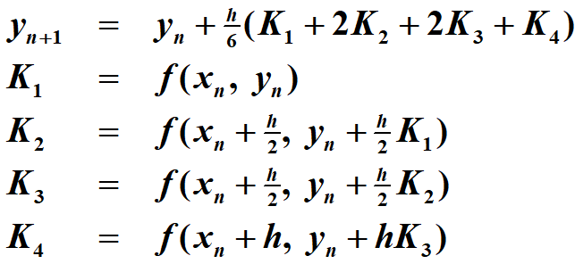
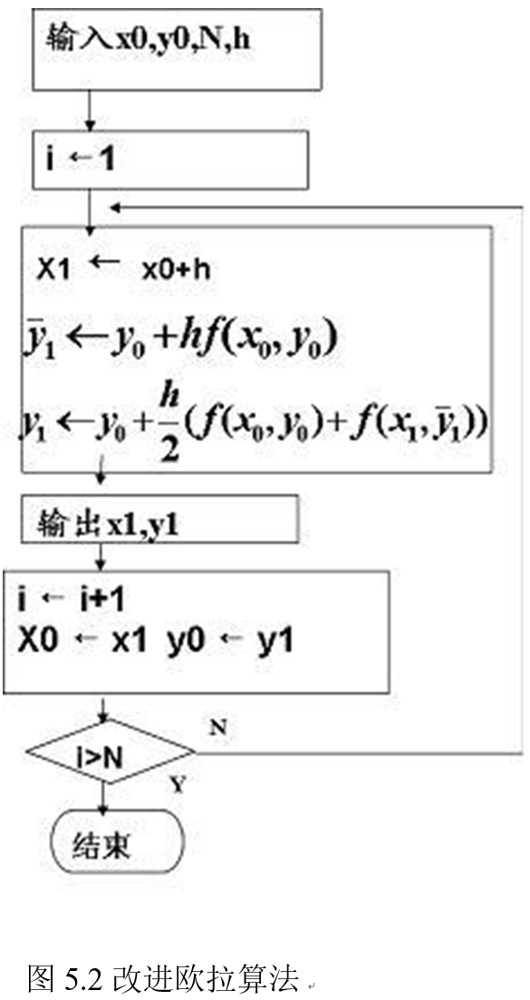
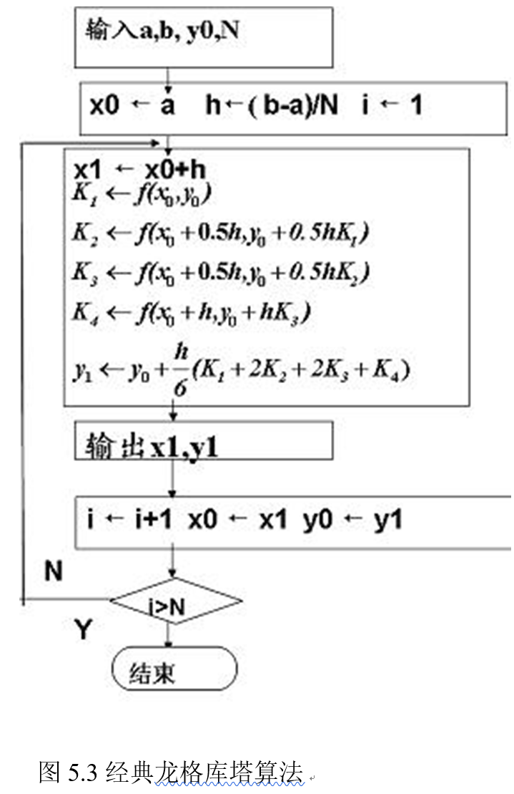
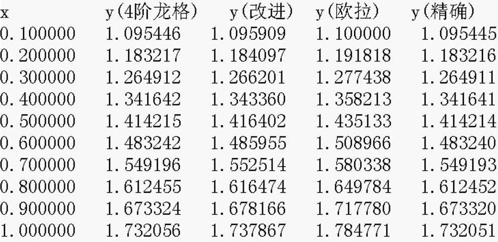

# Numerical Differential_exp

Numerical Analysis exp-5: Numerical Differential(数值微分)(欧拉公式|改进欧拉|四阶龙格-库塔)

实验五	数值微分

1  实验目的

(1)	熟悉数值微分中Euler法，改进Euler法，Rung-Kutta方法；

(2)	能编程实现Euler法，改进Euler法，Rung-Kutta方法；

(3)	通过实验结果分析各个算法的优缺点;

(4)	明确步长对算法的影响并理解变步长的Rung-Kutta方法

2  实验内容

取h=0.1时用Euler法，改进Euler法，Rung-Kutta方法求其数值解并与精确解进行比较。

输入：求解区间，初值，数值解个数

输出：数值解

3  算法基本原理

在许多科学技术问题中，建立的模型常常以常微分方程的形式表示。然而，除了少数特殊类型的常微分方程能用解析方法求其精确解外，要给出一般方程解析解的表达式是
困难的。所以只能用近似方法求其数值解，在实际工作中常用计算机求常微分方程的数值解。所谓常微分方程的数值解即对于常微分方程初值问题  计算出在一系列节点 a = x0< x1<…< xn= b 处的未知函数 y(x)近似值y0,y1,…yn，即找到一系列离散点（x0,y0）（x1,y1）（x2,y2）…（xn,yn）近似满足常微分方程。数值解法的基本思想用差商代替导数,实现连续问题离散化，选取不同的差商代替导数可以得到不同公式。
改进欧拉公式是常用方法之一，包括预测和校正两步。先用欧拉公式进行预报，再将预报值代入梯形公式进行校正，从而达到二阶精度。通过龙格-库塔法我们可以获得更高精度。经典龙格-库塔法即在区间[xn,xn+1]取四点，并对这四点的斜率进行加权平均作为平均斜率，通过泰勒公式寻找使局部截断误差为O(h5)（即4阶精度）的参数满足条件。

改进的欧拉公式：

预测 

校正 

四阶（经典）龙格-库塔公式

 
4  算法描述

(1) 改进的欧拉算法见流程图

(2)  经典龙格-库塔算法见流程图

5 计算用例的参考输出

（1）实验1参考输出如下

6 思考题

(1) 步长h对上述算法有何影响？

(2) 变步长的经典龙格-库塔算法如何实现？
