# Numerical Integration_exp

Numerical Analysis exp-2: Numerical Integration(数值积分)(复化梯型|复化辛普森|复化科特斯|龙贝格)

实验二	数值积分

1 实验目的

(1)	熟悉复化梯形方法、复化Simpson方法、梯形递推算法、龙贝格算法；

(2)	能编程实现复化梯形方法、复化Simpson方法、梯形递推算法、龙贝格算法；

(3)	理解并掌握自适应算法和收敛加速算法的基本思想；

(4)	分析实验结果体会各种方法的精确度，建立计算机求解定积分问题的感性认识

2  实验内容

（1）设计复化梯形公式求积算法，编制并调试相应的函数子程序

（2）设计复化辛浦生求积算法，编制并调试相应的函数子程序

（3）用龙贝格算法计算 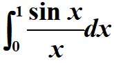

输入：积分区间，误差限

输出：序列Tn，Sn，Cn，Rn及积分结果（参考书本P71的表2-5）

取n=2，4，8，16，精确解为0.9460831

3  算法基本原理

在许多实际问题中，常常需要计算定积分 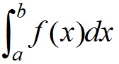 的值。根据微积分学基本定理，若被积函数f(x)在区间[a,b]上连续，只要能找到f(x)的一个原函数F(x)，便可利用牛顿-莱布尼兹公式  求得积分值。

但是在实际使用中，往往遇到如下困难，而不能使用牛顿-莱布尼兹公式。

（1）	找不到用初等函数表示的原函数

（2）	虽然找到了原函数，但因表达式过于复杂而不便计算

（3）	f(x)是由测量或计算得到的表格函数

由于以上种种困难，有必要研究积分的数值计算问题。

利用插值多项式 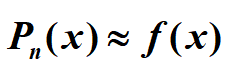 则积分 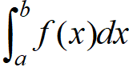 转化为 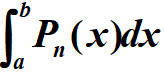 ，显然易算。 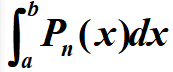 称为插值型求积公式。最简单的插值型求积公式是梯形公式和Simpson公式，。当求积结点提供较多，可以分段使用少结点的梯形公式和Simpson公式，并称为复化梯形公式、复化Simpson公式。如步长未知，可以通过误差限的控制用区间逐次分半的策略自动选取步长的方法称自适应算法。梯形递推公式给出了区间分半前后的递推关系。由梯形递推公式求得梯形序列，相邻序列值作线性组合得Simpson序列, Simpson序列作线性组合得柯特斯序列, 柯特斯序列作线性组合的龙贝格序列。若|R2-R1|<e,则输出R2;否则…依此类推。如此加工数据的过程叫龙贝格算法，如下图所示：
 
 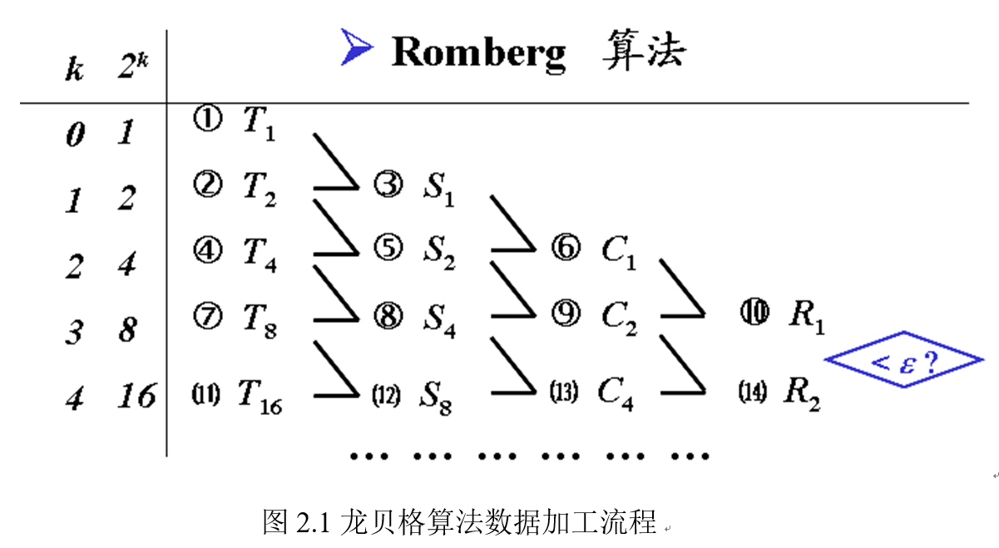

复化梯形公式 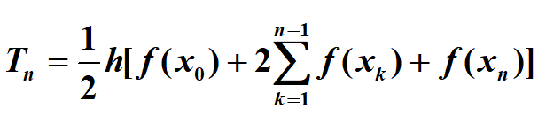

复化Simpson公式 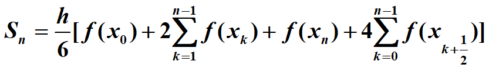

梯形递推公式 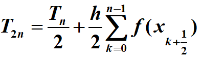

加权平均公式：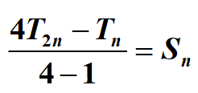
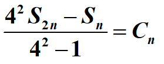
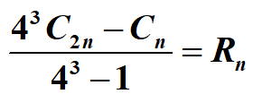

龙贝格算法大大加快了误差收敛的速度，由梯形序列O(h2) 提高到龙贝格序列的O(h8)

4  算法描述

(1)	梯形递推算法见流程图

(2)	龙贝格算法见流程图

5 计算用例的参考输出

实验1参考输出如下

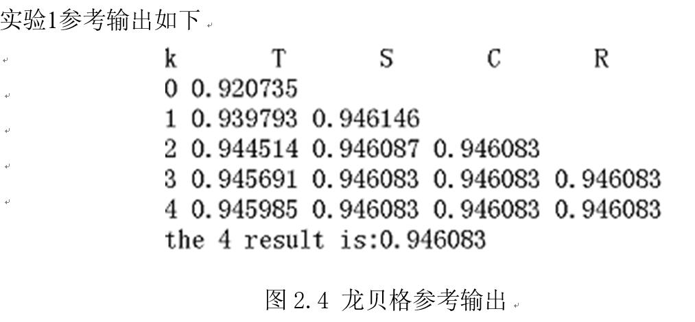

6思考题
(1) 龙贝格算法除了本流程图的实现方法，用二维数组的存储方式如何实现？

(2) 根据定积分的计算方法，考虑二重积分的计算问题。
