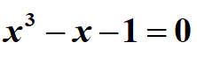
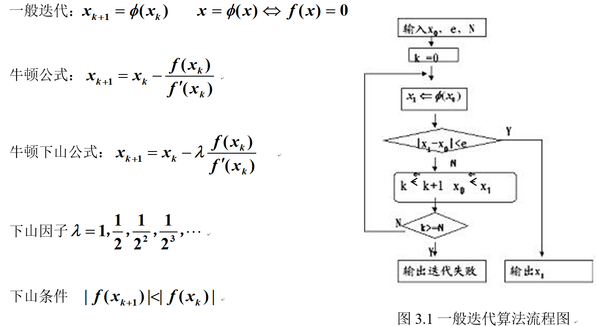
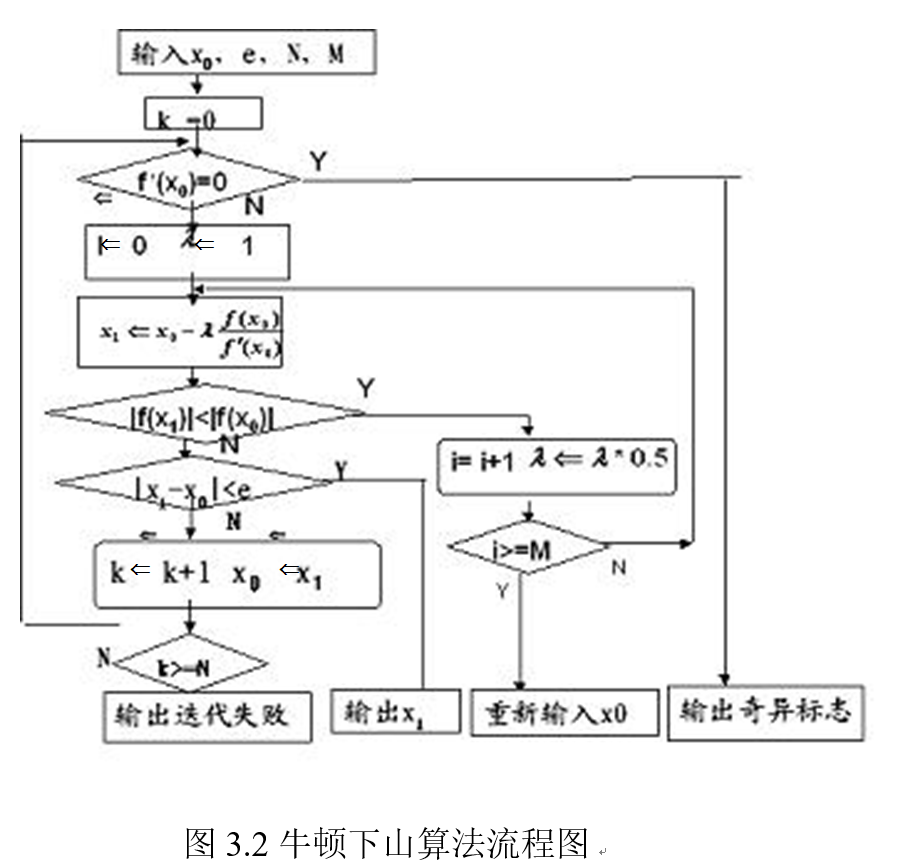

# Recursively Solving Nonlinear Equations_exp

Numerical Analysis exp-3: Recursively Solving Nonlinear Equations_exp(非线性方程迭代法求根)(牛顿下山法)

实验三	非线性方程求根迭代法

1  实验目的

(1)	熟悉非线性方程求根简单迭代法，牛顿迭代及牛顿下山法

(2)	能编程实现简单迭代法，牛顿迭代及牛顿下山法

(3)	认识选择迭代格式的重要性

(4)	对迭代速度建立感性的认识；分析实验结果体会初值对迭代的影响

2  实验内容

（1）用牛顿下山法解方程  （初值为0.6）

输入：初值，误差限，迭代最大次数，下山最大次数

输出：近似根各步下山因子 

3  算法基本原理

求非线性方程组的解是科学计算常遇到的问题，有很多实际背景．各种算法层出不穷，其中迭代是主流算法。只有建立有效的迭代格式，迭代数列才可以收敛于所求的根。因此设计算法之前，对于一般迭代进行收敛性的判断是至关重要的。牛顿法也叫切线法，是迭代算法中典型方法，只要初值选取适当，在单根附近，牛顿法收敛速度很快，初值对于牛顿迭代

至关重要。当初值选取不当可以采用牛顿下山算法进行纠正。

4  算法描述

一般迭代算法见流程图

牛顿下山算法见流程图：

5 计算用例的参考输出

实验1输出参考书本p130页结果

6  思考题

（1）在实验1当最大下山比较大（如超过20）在x0=0.1及其附近将会产生什么结果？原因？

（2）如何将牛顿公式中的导数近似替换成差商并编程实现？

（3）分析迭代收敛和发散的原因
