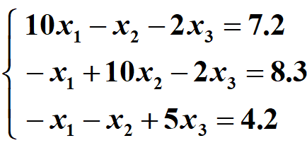
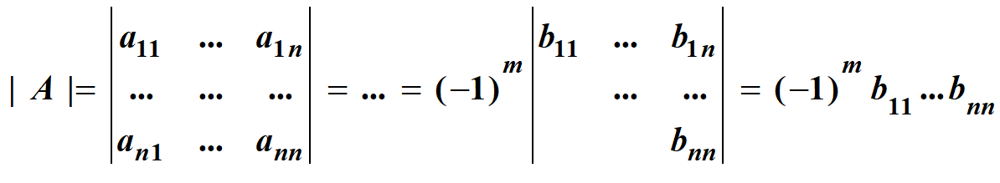
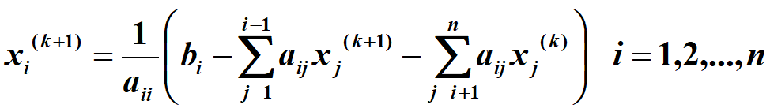
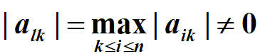
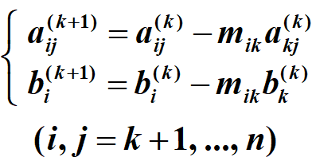
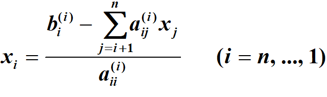
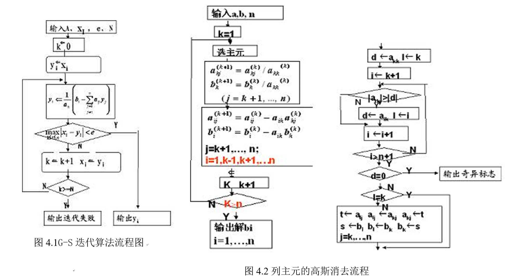

# Solving Linear Equations_exp

Numerical Analysis exp-4: Solving-Linear-Equations(求解线性方程组)(高斯赛德尔迭代|高斯消元)

实验四	 求解线性方程组

1 实验目的

(1)	熟悉求解线性方程组的有关理论和方法；

(2)	能编程实现雅可比及高斯-塞德尔迭代法、列主元高斯消去法、约当消去，追赶法

(3)	通过测试，进一步了解各种方法的优缺点

(4)	根据不同类型的方程组，选择合适的数值方法

2  实验内容

（1）用Gauss - Seidel 迭代法求解方程组 

输入：系数矩阵A，最大迭代次数N，初始向量，误差限e

输出：解向量

（2）用选主元高斯消去求行列式值 

提示：

A.	 

B.	消元结果直接存储在系数矩阵中

C.	当消元过程发生两行对调的情况为偶数次时，行列式值为对角线乘积，否则为对角线乘积的相反数。

3  算法基本原理

无论是三次样条还是拟合问题最终都归结为线性方程组，求解线性方程组在数值分析中非常重要，在工程计算中也不容忽视。

线性方程组大致分迭代法和直接法。只有收敛条件满足时，才可以进行迭代。雅可比及高斯-塞德尔是最基本的两类迭代方法，最大区别是迭代过程中是否引用新值进行剩下的计算。消元是最简单的直接法，并且也十分有效的，列主元高斯消去法对求解一般的线性方程组都适用，同时可以用来求矩阵对应的行列式。约当消去实质是经过初等行变换将系数矩阵化为单位阵，主要用来求矩阵的逆。在使用直接法，要注意从空间、时间两方面对算法进行优化。

高斯-塞德尔迭代：   

列主元高斯消去法：列主元 

消元    回代 
   
4  算法描述

Gauss - Seidel算法见流程图

列主元的高斯消去算法见流程图

5计算用例的参考输出

实验1输出参考书本p146页 表5-2

实验2参考输出：18

6 思考题

(1)	对于具体的线性方程组该选用何种方法达到节省时间和空间的目的？

 
